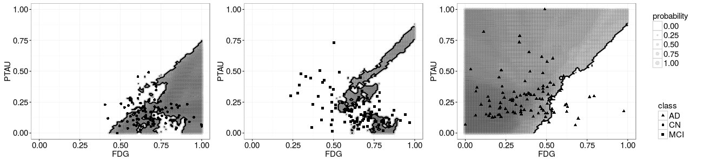
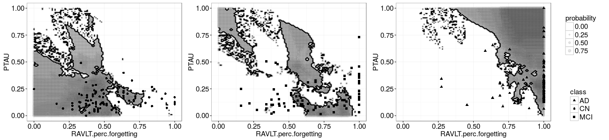
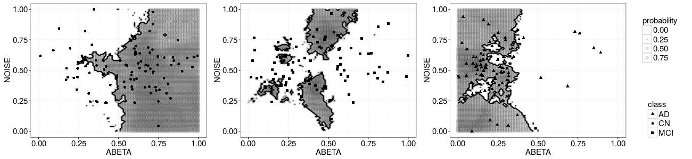

Plots
-------

All figures for all combinations within 2 features. All classification mappings are min-max normalized, with optimum k and unbalanced dataset. The name axis are simplified since the scale is normalized.

Figures
-------

